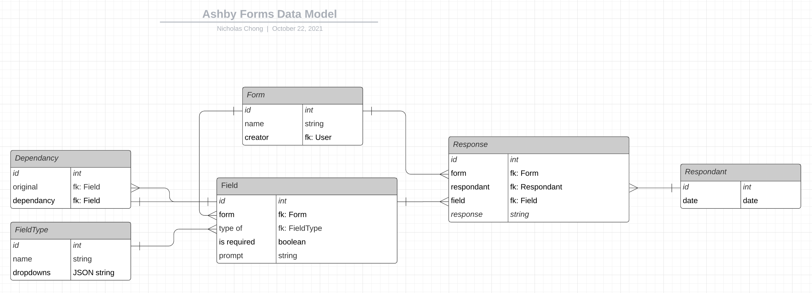

# Forms Prototype

This project includes the prototype backend and frontend code for the Forms App.

To start the API run ```python manage.py runserver```

To start the frontend run ```npm run start```

# Backend API

## Tech Stack

The backend is built on the **Django Rest Framework (DRF).** DRF provides a toolkit for building REST APIs. Key built in features include data serialization and Oauth1/Oauth2 support. DRF's flexibility also makes it easy to add new endpoints, ensuring that our API service can continue to expand as the product grows. DRF has been proven to work at scale, with large companies like Red Hat, Heroku, and Eventbrite using the framework. 

## Endpoints

|  Endpoint | Usage|
| ------------- | ------------- |
| GET /form | Retieves all the forms  |
| POST /form | Creates a new form |
| GET /form/{form id} | Retrieves a sepcific form |
| POST /response/save_form_responses | Saves a list of new responses |
| GET /response?form={form id}| Retrieves specific responses |

## Data Model



This section will go over a few of the more complex/challenging decisions I made when designing the data models.

### Storing Responses

The initial design had the different types of responses stored in seperate tables (email, boolean, text, etc). This design ensured that the number of rows in each table would be relatively small, ensuring faster query speeds. However, it also resulted in a design in which several tables had the possibilty of being under utilized (ex. If the "boolean" response type turns out to be unpopular among users, the "boolean" table would be under utilized). 

I decided it was not worth the complexity of storing different response types in seperate tables, and modified the design to store all responses in one table. 

### Conditional Fields (To be implemented)

The Dependency table holds a respective fields dependencies. It is effectively a "circular" relationship between Field -> Dependency -> Field. Conditional fields should be rendered if all its dependancies have been filled in.

# Front End React Client

The frontend client is a **React Single Page Application (SPA).** 

(I know frontend wasnt technically part of the challenge, but I have a fun time building it out anyways :) )


## Rendering the Form

The SPA calls the backend ```/form/{form id}``` endpoint to retrieve a form. The form data is then parsed and rendered in React. 

Sample form data:

```json
{
    "prompts": [
        {
            "type_of": "boolean",
            "is_required": true,
            "prompt": "Are you taller than The Rock?",
            "dependencies": []
        },
        {
            "type_of": "text",
            "is_required": true,
            "prompt": "What country are you from?",
            "dependencies": []
        }
    ],
    "name": "The Test POST Form",
    "creator": "Nicholas Chong"
}
```

## Collecting and Submitting Responses

When a input field is modified, the SPA updates a list of responses. When the user submits the form, this list of responses is sent to the API via a POST request.

Sample response data:

```json
[
    {
        "response": "True",
        "form": 1,
        "respondant": 1,
        "field": 1
    },
    {
        "response": "False",
        "form": 1,
        "respondant": 1,
        "field": 1
    },
    {
        "response": "True",
        "form": 1,
        "respondant": 1,
        "field": 1
    },
    {
        "response": "True",
        "form": 1,
        "respondant": 1,
        "field": 1
    }
]
```
